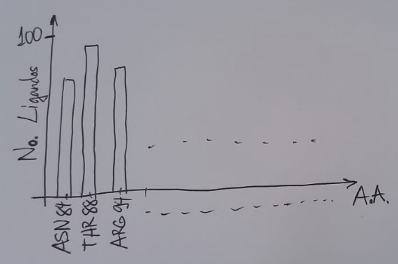

Tomarán como base para realizar el ejercicio, los resultados del cribado virtual que ejecutaron para la proteína PI3K de hongo (cada uno con su proteína de una especie en particular), con la base dada de 100 moléculas (ligandos). También pueden utilizar los scripts (todos los que les sirvan) que programaron en el proyecto de curso.

Para cada ligando de la base de 100, y solo para la primera solución (Model 1) dada por el programa Autodock Vina, determinarán de manera automatizada cuáles aminoácidos (residuos) de la proteína están interactuando con el ligando.

Criterio de interacción: El aminoácido A interactúa con el ligando L si existe al menos una pareja formada por un átomo de A y un átomo de L, con una distancia menor de 4 A entre ambos átomos.

Presentación de los resultados:

1- Tabla que muestre, para cada ligando, el número de aminoácidos interactuantes (N_AA_Interact), y una lista de los aminoácidos que interactúan con el ligando (AA1, AA2...), con el átomo del ligando más cercano al aminoácido (AL1, AL2, ...) y la distancia de interacción entre ellos (Dmin1, ...).
Ejemplo: 
Código_ligando:  N_AA_Interact
AA1  AL1  Dmin1
AA2  AL2  Dmin2
.....

2- Gráfico del número de ligandos que interactúan con cada uno de los aminoácidos identificados (cada A.A. que interactúa al menos con uno de los ligandos). En la siguiente figura se ilustra el tipo de gráfico requerido:

